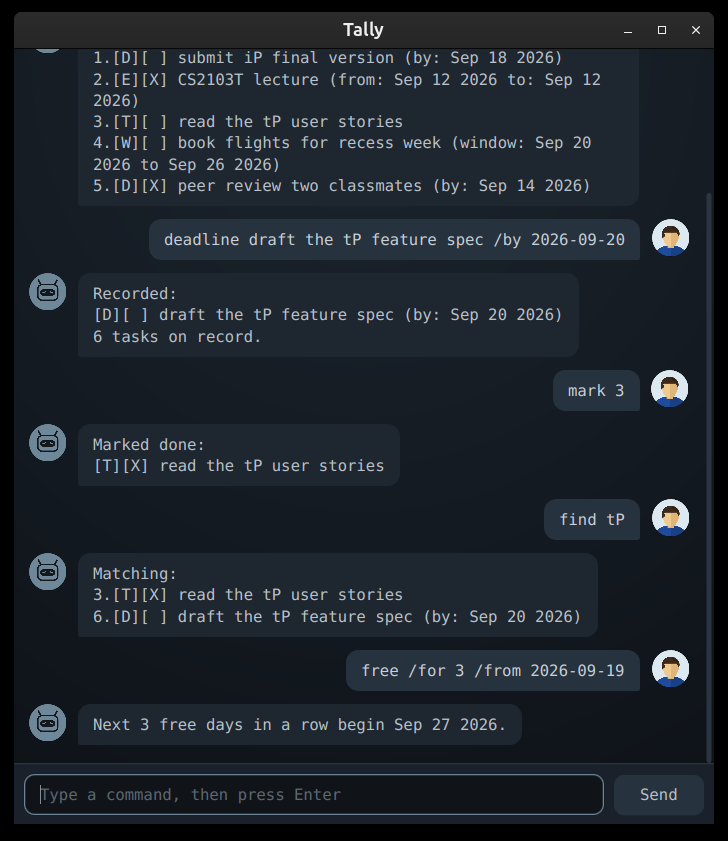

# Tally 🧾

**Tally** keeps a running tally of your tasks: what is due, what is happening, and
what you keep meaning to get to. It saves every change as you make it, so what you
wrote down is still there tomorrow.

It is blunt about it. That is the point.



## Getting started

1. Check you have **Java 25**: run `java -version` in a terminal.
2. Download `tally.jar` from the [latest release](https://github.com/dillionlim/ip/releases/tag/v0.5).
3. Put it in a folder of its own. Tally keeps your tasks in `data/tally.txt` beside
   the jar, so give it somewhere to do that.
4. Run it:

   ```bash
   java -jar "tally.jar"
   ```

Type a command, press <kbd>Enter</kbd>, and Tally answers.

## Features

### Adding a task

Tally records four kinds of task. Which one you want depends on whether it has a
date, and what that date means.

#### `todo`: something with no date attached

```
todo DESCRIPTION
```

> **You:** `todo read the tP user stories`
>
> **Tally:**
> ```
> Recorded:
> [T][ ] read the tP user stories
> 1 task on record.
> ```

#### `deadline`: something due on a particular day

```
deadline DESCRIPTION /by yyyy-mm-dd
```

> **You:** `deadline submit iP final version /by 2026-09-18`
>
> **Tally:**
> ```
> Recorded:
> [D][ ] submit iP final version (by: Sep 18 2026)
> 1 task on record.
> ```

#### `event`: something that runs from one time to another

```
event DESCRIPTION /from START /to END
```

> **You:** `event CS2103T lecture /from 2026-09-12 4pm /to 6pm`
>
> **Tally:**
> ```
> Recorded:
> [E][ ] CS2103T lecture (from: 2026-09-12 4pm to: 6pm)
> 1 task on record.
> ```

An event's two times are kept **exactly as you type them**, so `Mon 2pm` is as
welcome as a date. The trade is that Tally cannot tell which days those are, so an
event written that way is not counted when you ask for free days, and it says so
when that happens.

If you write both ends as dates, Tally can compare them, and it refuses an event
that ends before it starts. Written any other way they are yours to order, since
nothing can read them.

#### `window`: something you may do any time between two dates

```
window DESCRIPTION /between yyyy-mm-dd /and yyyy-mm-dd
```

> **You:** `window book flights /between 2026-09-20 /and 2026-09-26`
>
> **Tally:**
> ```
> Recorded:
> [W][ ] book flights (window: Sep 20 2026 to Sep 26 2026)
> 1 task on record.
> ```

### `list`: see everything on record

```
list
```

> **Tally:**
> ```
> On record:
> 1.[T][ ] read the tP user stories
> 2.[D][ ] submit iP final version (by: Sep 18 2026)
> ```

`[X]` means done, `[ ]` means not. The letter is the kind: `T`, `D`, `E` or `W`.

### `mark` and `unmark`: done, or not after all

```
mark NUMBER
unmark NUMBER
```

The number is the one `list` shows beside the task.

> **You:** `mark 1`
>
> **Tally:**
> ```
> Marked done:
> [T][X] read the tP user stories
> ```

### `delete`: take a task off the record

```
delete NUMBER
```

> **You:** `delete 1`
>
> **Tally:**
> ```
> Struck from the record:
> [T][ ] read the tP user stories
> 0 tasks on record.
> ```

### `find`: search descriptions

```
find TEXT
```

Any part of a description matches, and case does not matter. Tasks keep the numbers
they have on the full list, so you can `mark` or `delete` straight from the results.

> **You:** `find tP`
>
> **Tally:**
> ```
> Matching:
> 1.[T][ ] read the tP user stories
> 2.[D][ ] draft the tP feature spec (by: Sep 20 2026)
> ```

### `free`: when are you next free?

```
free [/for COUNT] [/from yyyy-mm-dd]
```

Both parts are optional. On its own, `free` finds the next day nothing takes up.
`/for` asks for that many free days in a row, and `/from` starts the search
somewhere other than today. Tally looks a year ahead and no further.

> **You:** `free /for 3 /from 2026-09-19`
>
> **Tally:**
> ```
> Next 3 free days in a row begin Sep 27 2026.
> ```

### `bye`: close the window

```
bye
```

> **Tally:** `Session ended. Your tasks did not.`

## Command summary

| Action | Format | Example |
| --- | --- | --- |
| Add a todo | `todo DESCRIPTION` | `todo read the tP user stories` |
| Add a deadline | `deadline DESCRIPTION /by yyyy-mm-dd` | `deadline submit iP /by 2026-09-18` |
| Add an event | `event DESCRIPTION /from START /to END` | `event lecture /from Fri 4pm /to 6pm` |
| Add a window | `window DESCRIPTION /between yyyy-mm-dd /and yyyy-mm-dd` | `window book flights /between 2026-09-20 /and 2026-09-26` |
| List everything | `list` | `list` |
| Mark done | `mark NUMBER` | `mark 1` |
| Mark not done | `unmark NUMBER` | `unmark 1` |
| Delete | `delete NUMBER` | `delete 1` |
| Search | `find TEXT` | `find tP` |
| Find free days | `free [/for COUNT] [/from yyyy-mm-dd]` | `free /for 3 /from 2026-09-19` |
| Leave | `bye` | `bye` |

## Worth knowing

- **Dates are written `yyyy-mm-dd`**, everywhere Tally reads one. `2026-09-18`, not
  `18/9/26`. An event's times are the exception: those are yours to write.
- **Commands don't care about capitals.** `List`, `TODO` and `bye` all work.
- **The same task twice is refused.** Tally tells you where the first one is rather
  than leaving you two entries you cannot tell apart. A saved file naming the same
  task twice is read back as one, and says so.
- **`|` cannot appear in a description**, because that is how the saved file
  separates one part of a task from the next.
- **Your tasks save themselves** to `data/tally.txt` after every change. There is no
  save command and nothing to remember.

## If something goes wrong

| What you see | What it means |
| --- | --- |
| `Unknown command. The ones I answer to: ...` | The first word was not a command. The list that follows is all of them. |
| `Unreadable date: "monday". The form is yyyy-mm-dd...` | Write the date as `2026-09-18`. |
| `Already on record as task 3. Once is enough.` | That task is already there, at number 3. |
| `Line 2 of tally.txt could not be read...` | Someone edited the saved file by hand and a line no longer makes sense. Tally keeps the rest, and copies the whole file to `tally.txt.broken` so you can repair it. |
| `tally.txt could not be read...` | Tally could not open the file at all, so it started empty, and it will **not** write over a file it could not read. Move it aside or fix its permissions, then start Tally again. |
